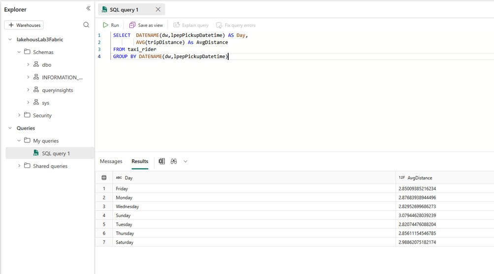
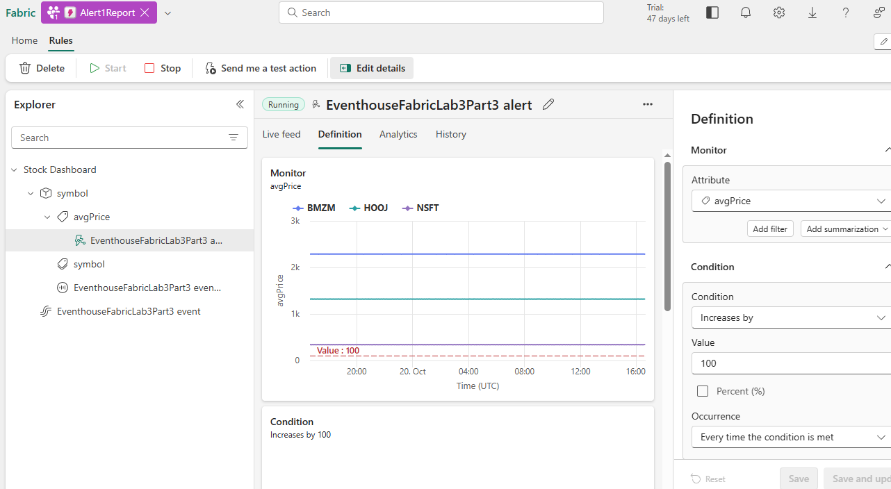

# Miscosoft Azure and Fabric
## Azure and Fabric fundamentals, Cloud system utilisation

## Overview
In this part of the portfolio my pracrice and experience of using Microsoft Azure and Microsoft Fabric will be shown, focusing on how cloud technologies are used to manage, store, and analyse data efficiently. Through a series of tasks and labs, the key learning outcomes included understanding the core concepts of cloud computing, identifying Azure services for data storage and analytics, and applying best practices for data protection and compliance. Practical exercises demonstrated how to handle both relational and non-relational data in Azure, automate data flows with Azure Data Factory, and use analytical tools like Azure Synapse Analytics and Power BI for generating insights.

As part of the projects I had to acknowledge myself with some of the important laws regarding data and computer technologies protection.
| Law | Short description |
|-----|-------------------|
| GDPR (General Data Protection Regulation) | Ensuring personal data is collected and processed lawfully and transparently. |
| Data Protection Act 2018 | Reinforcing data security, fairness, and accountability. |
| Computer Misuse Act 1990 | Protects computer systems from unauthorised access, data theft, and malicious activities such as hacking or the spread of malware. |
---
## Tools
- Microsoft Azure
    - SQL Database
    - Azute Cosmos DB
    - Azure Synapse Analytics
- Microsoft Fabric
    - Eventstream
    - KQL Database
    - Lakehouse
    - Real-time dashboard
 ## Skills developed
 ### Technical skills
- Cloud Computing Fundamentals — gained a solid understanding of cloud infrastructure, deployment models (IaaS, PaaS, SaaS), and their business benefits.

- Data Storage and Management — learned how to create and manage Azure SQL Databases and Azure Cosmos DB to store and query structured and unstructured data efficiently.

- Data Analytics and Integration — developed the ability to use Azure Synapse Analytics and Microsoft Fabric Lakehouse to process, transform, and visualise large datasets for business insights.

- Real-time Data Processing — explored Eventstream and KQL Databases in Microsoft Fabric to collect, analyse, and monitor data in real time.

- Automation and Data Flow Design — practised building automated data pipelines using Azure tools to improve efficiency and reliability of data processing.
### Analytical skills
- Data Modelling and Querying — improved the ability to design relational models, create relationships between data entities, and use SQL and KQL queries for analysis.
- Problem Solving — applied analytical reasoning to recommend suitable Azure services for specific business needs.

