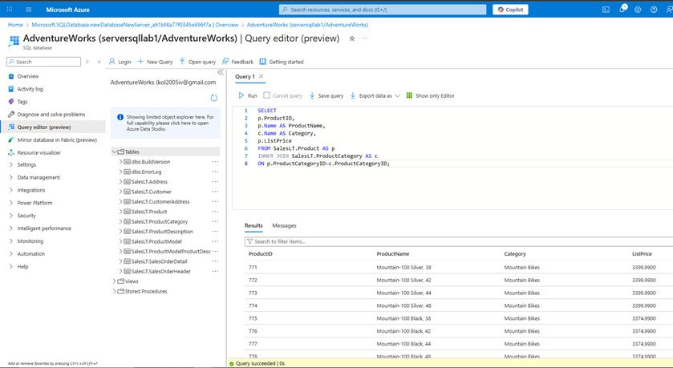

# Miscosoft Azure and Fabric
## Azure and Fabric fundamentals, Cloud system utilisation

## Overview
In this part of the portfolio my pracrice and experience of using Microsoft Azure and Microsoft Fabric will be shown, focusing on how cloud technologies are used to manage, store, and analyse data efficiently. Through a series of tasks and labs, the key learning outcomes included understanding the core concepts of cloud computing, identifying Azure services for data storage and analytics, and applying best practices for data protection and compliance. Practical exercises demonstrated how to handle both relational and non-relational data in Azure, automate data flows with Azure Data Factory, and use analytical tools like Azure Synapse Analytics and Power BI for generating insights.

As part of the projects I had to acknowledge myself with some of the important laws regarding data and computer technologies protection.
| Law | Short description |
|-----|-------------------|
| GDPR (General Data Protection Regulation) | Ensuring personal data is collected and processed lawfully and transparently. |
| Data Protection Act 2018 | Reinforcing data security, fairness, and accountability. |
| Computer Misuse Act 1990 | Protects computer systems from unauthorised access, data theft, and malicious activities such as hacking or the spread of malware. |
