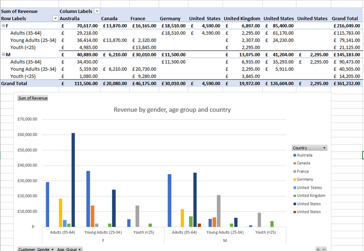

# Microsoft Excel
## Microsoft Excel fundamentals. Calculations and Data visualisation

## Overview
In this part of protfolio skills and tools used will be descrived and demonstrated for data analysis and visualisation
using Microsoft Excel. Through a sequence of practical exercises, it developed both technical and analytical skills essential
for working with business datasets and presenting insights clearly.The tasks focused on using Excel’s core features such as
tables, formulas, pivot tables, and data visualisations to explore and interpret data effectively.
Learners also applied logical functions such as SWITCH for categorisation, and used tools like conditional formatting,
charts, and filtering to identify trends and patterns.
