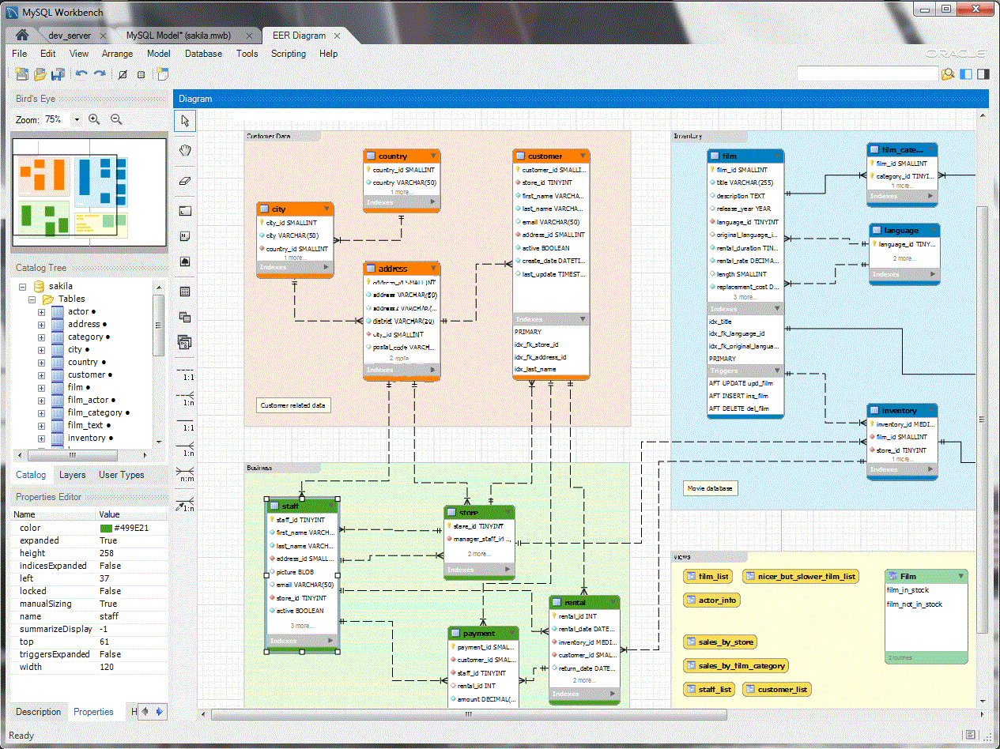

# MySQL
## MySQL fundamentals. Creating data queries

##Overview
In this part of the portfolio my pracrice and experience of using MySQL and the fundamentals of database design and management. The work was focused on understanding how data is structured, stored, and retrieved using Structured Query Language (SQL). Through theoretical exercises and practical database scenarios, the workbook developed both technical and analytical skills essential for managing relational data systems.
