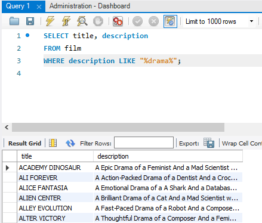

# MySQL fundamentals. Creating data queries

## Overview
As another part of my Data Analyst bootcamp, I was completing comprehensive SQL practice tasks using the Sakila Database, a sample database representing a DVD rental business. This practical experience developed my proficiency in relational database querying, data manipulation, and analytical problem solving using MySQL. The exercises progressed from fundamental queries to complex multi table operations, building a solid foundation in database management and SQL programming. 

---

## Tools
- SELECT selecting columns from a table
- FROM to select a table from which columns are taken
- WHERE to create a condition to query columns that meet a condition
- LIKE to create a condition where a value should contain or is equal to a value that is expected to appear
- BETWEEN and AND to create a mathematical opperation to query values that are in a range
- GROUP BY to group values
- SORT BY to sort by ascending (ASC), or descending (DESC) order
- LIMIT to query only certain amount of rows
- DISTINCT keyword to eliminate duplicate records 
- INNER JOIN to combine related tables 
- LEFT JOIN and RIGHT JOIN for inclusive data retrieval 
- HAVING operation to filter grouped results based on aggregate conditions 
- COUNT(), SUM(), AVG(), MIN(), and MAX() functions for aggregation
- Subqueries

   

---

## Technical skills developed
- Basic data retrieval and filtering using SELECT and WHERE statements
- Pattern matching and text search using LIKE operator
- Aggregate function applying using COUNT(), SUM(), AVG(), MIN(), and MAX() functions
- Advanced filtering and sorting using GROUP BY, SORT BY, ASC, and DESC
- Subquery implementation

## Data Analysis techniques
- Breaking complex requirements into manageable query components
- Debugging SQL syntax and logical errors
- Validating query results against expected outcomes
