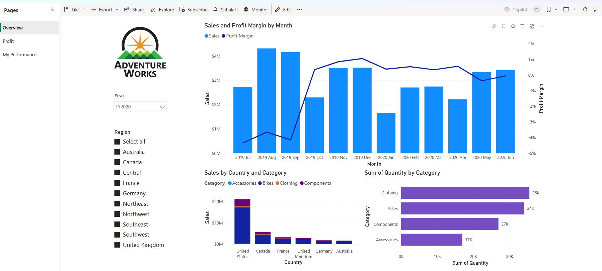
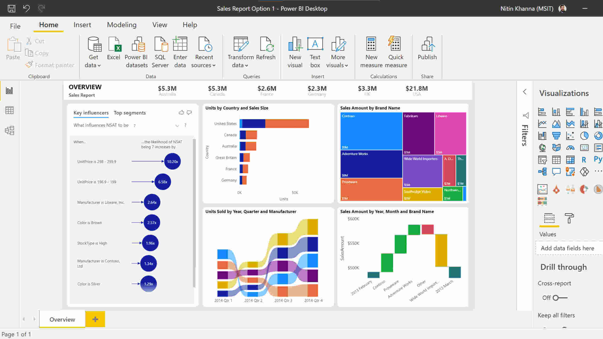

# Power BI. Data cleaning, visualisation, and presentation cleaning, visualisation, and presentation
As part of my Data Analyst bootcamp programme, I completed a structured series of virtual laboratory works using Microsoft Power BI Desktop, progressing from fundamental data operations to creating sophisticated interactive dashboards. This experience provided me with practical skills in the complete business intelligence workflow, from raw data ingestion to final report deployment. 

---

## Tools
- Removing data duplication
- Query appending and merging
- Uploading data from multiple sources
- Schema management
- Transposing
- Replacing values
- Pivotting columns
- Applying aggregate functions
- Creating visualisations
- Sorting/Filtering/Slicing
- Publishing dashboard

---

## Technical skills developed
- Multi-source data integration and relationship management 
- Star schema and data modelling principles 
- Data Analysis Expressions fundamentals for calculated measures 
- Aggregation and summarisation techniques 
- Chart selection based on analytical objectives 
- Visual hierarchy and information architecture 
- Navigating Power BI's interface efficiently and leveraging advanced features 
