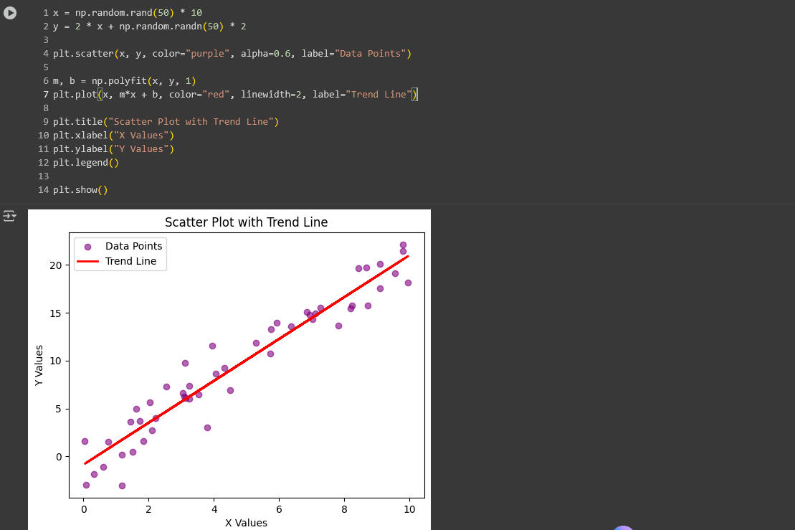
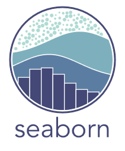

# Python. Utilisation of libraries for data retrieval and manipulation
During another week of Data Analysis bootcamp programme , I developed comprehensive Python programming skills with a strong focus on data analysis, manipulation, and visualisation. Working primarily with essential data science libraries, I progressed from fundamental programming concepts to advanced data analytics techniques, building practical capabilities applicable to real world data engineering and analysis scenarios. 

---

## Tools
- Pandas library
- Numpy libraty
- Matplotlib library
- Seaborn library
- Custom functions
- Loops (for, while, range)
- Logical operators
- Input/Output operations
- Casting (Parsing)
- Pandas functions for data retrieval (head, loc, iloc, describe, info, read_csv, groupby, sort_values)
- Data visualisations using Matplotlib
- Data cleaning and transformation
- Statisical computations (Numpy)
- Enhanced statistical graphs (Seaborn)

   
