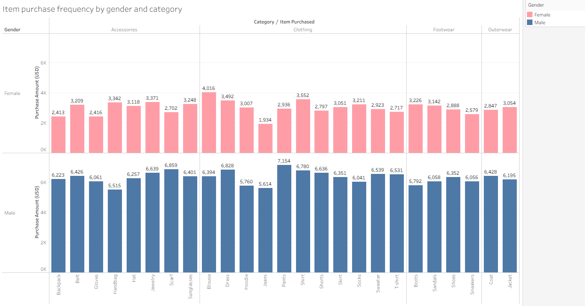

# Tableau. Visualising data
I developed practical data visualisation skills using Tableau, progressing from understanding platform fundamentals to creating complex, multi layered analytical dashboards. Working with diverse real world datasets spanning employment trends, entertainment analytics, and healthcare indicators, I demonstrated the ability to transform raw data into compelling visual narratives that support strategic decision-making across various organisational contexts. 

---

# Tools
- Multiple visualization types: scatter plots, bar charts, heat maps 
- Multi variate visualisations
- Data aggregation
- Connection to CSV/Excel sources 
- Filtering/Sorting/Slicing
- Colouring, sizing, labelling
- Transposing
- Dashboard creating
- Calculating fields
- Formatting
- Forecasting

 

---

## Technical skills developed
- Advanced dashboard creation
- Colour encoding to distinguish positive/negative trends
- Geographical mapping with latitude/longitude coordinates
- Size or color intensity to represent magnitude of change
- Data import and connection to CSV/Excel sources
- Dual chart integration within a single dashboard
- Percentage calculation and display formatting
- Dashboard layout design for coherent information flow
- Statistical trend identification and pattern recognition
- Data storytelling through sequential visualisations
- Visualisation design
- Critical evaluation of visual outputs

